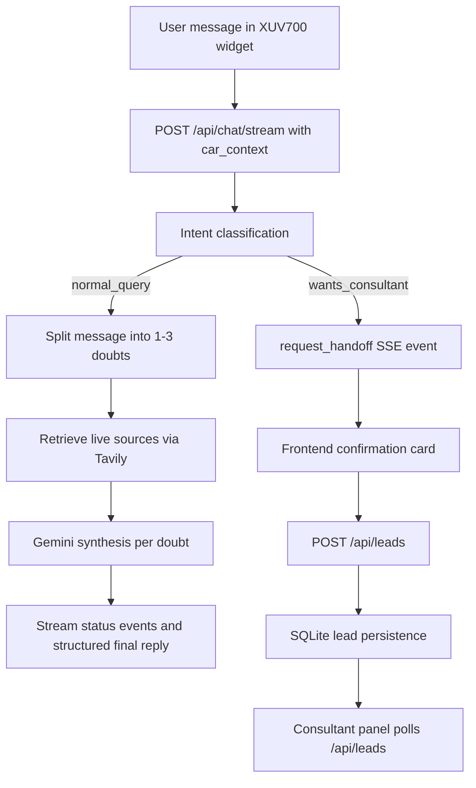

# AutoElite AI Sales Assistant

This demo shows a Mahindra XUV700 dealership catalog with a floating AI sales assistant and a connected consultant dashboard. Buyers ask questions from the car page, the backend silently injects the XUV700 context, streams retrieval/synthesis progress over SSE, and can hand off high-intent users into a SQLite-backed lead queue visible in the consultant panel.



## Why this design

Context is injected silently because the buyer is already on the XUV700 catalog page; asking which car they mean would add friction and violate the page-level intent. Status events are streamed because real retrieval takes visible steps, and labels like “Searching live car sources” and “Comparing specs” create more trust than a generic spinner. Handoff is a confirmation step because phone capture is sensitive and should happen only after the user explicitly agrees. This maps to Mode 1 as the self-serve AI product consultant and Mode 2 as the human consultant workflow fed by qualified leads.

## Setup

Required env vars:

- `backend/.env`
  - `GEMINI_API_KEY`
  - `GEMINI_MODEL` defaults to `gemini-1.5-flash`
  - `TAVILY_API_KEY`
  - `DATABASE_URL` defaults to `sqlite:///./data/demo.db`
  - `FRONTEND_ORIGIN` defaults to `http://localhost:3000`
- `frontend/.env.local`
  - `NEXT_PUBLIC_API_URL=http://localhost:8000`

Local run:

```bash
cp backend/.env.example backend/.env
cp frontend/.env.example frontend/.env.local

cd backend
python -m venv .venv
. .venv/bin/activate
pip install -r requirements.txt
uvicorn app.main:app --reload --host 127.0.0.1 --port 8000
```

In another terminal:

```bash
cd frontend
npm install
npm run dev
```

Open `http://localhost:3000/cars/xuv700` for the catalog and `http://localhost:3000/consultant` for the consultant panel.

Docker Compose:

```bash
cp backend/.env.example backend/.env
docker compose up --build
```

The backend will not fabricate live specs or pricing. If Gemini or Tavily keys are missing, or if retrieval fails, chat responses use an honest “couldn’t confirm this right now” fallback.
