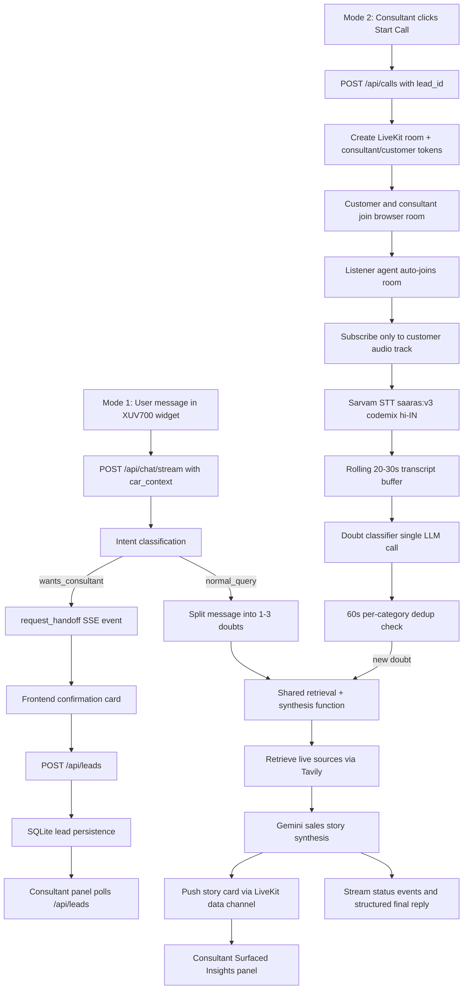

# AutoElite AI Sales Assistant

This demo shows a Mahindra XUV700 dealership catalog with a floating AI sales assistant and a connected consultant dashboard. Buyers ask questions from the car page, the backend silently injects the XUV700 context, streams retrieval/synthesis progress over SSE, and can hand off high-intent users into a SQLite-backed lead queue visible in the consultant panel.

## Mode 2 — Live Listening

Mode 2 adds a browser-call demo for a live consultant conversation. The customer and consultant join the same LiveKit room, a silent backend listener agent joins automatically, listens only to the customer audio track, transcribes with Sarvam codemix STT, detects car-buying objections, and pushes synthesized sales story cards into the consultant's live insights panel in real time.



## Why this design

Context is injected silently because the buyer is already on the XUV700 catalog page; asking which car they mean would add friction and violate the page-level intent. Status events are streamed because real retrieval takes visible steps, and labels like “Searching live car sources” and “Comparing specs” create more trust than a generic spinner. Handoff is a confirmation step because phone capture is sensitive and should happen only after the user explicitly agrees. This maps to Mode 1 as the self-serve AI product consultant and Mode 2 as the human consultant workflow fed by qualified leads.

Mode 2 does not need diarization because LiveKit already separates each participant into distinct tracks; the listener connects with no automatic subscriptions and explicitly subscribes only to identity `customer`, so the consultant's speech cannot trigger objection detection. The retrieval and synthesis path is reused through the same backend helper used by `/api/chat/stream`, which keeps source grounding, cache behavior, fallback discipline, and answer-card shape consistent between modes. Dedup prevents the insights panel from repeating the same objection every time the customer restates it. In production, this same architecture bridges to real phone calls through LiveKit SIP; browser call rooms are the demo substitute for telephony, not a separate design.

## Setup

Required env vars:

- `backend/.env`
  - `GEMINI_API_KEY`
  - `GEMINI_MODEL` defaults to `gemini-2.5-flash`
  - `TAVILY_API_KEY`
  - `DATABASE_URL` defaults to `sqlite:///./data/demo.db`
  - `FRONTEND_ORIGIN` defaults to `http://localhost:3000`
  - `LIVEKIT_URL`
  - `LIVEKIT_API_KEY`
  - `LIVEKIT_API_SECRET`
  - `SARVAM_API_KEY`
- `frontend/.env.local`
  - `NEXT_PUBLIC_API_URL=http://localhost:8000`

Local run requires three processes:

```bash
cp backend/.env.example backend/.env
cp frontend/.env.example frontend/.env.local

cd backend
python -m venv .venv
. .venv/bin/activate
pip install -r requirements.txt
uvicorn app.main:app --reload --host 127.0.0.1 --port 8000
```

In another terminal:

```bash
cd backend
. .venv/bin/activate
python -m agent.listener_agent
```

In a third terminal:

```bash
cd frontend
npm install
npm run dev
```

Open `http://localhost:3000/cars/xuv700` for Mode 1 and `http://localhost:3000/consultant` for the consultant panel. For Mode 2, click `Start Call` on a lead, copy the generated customer link into a second browser/device, then join as the consultant in the current browser.

Docker Compose:

```bash
cp backend/.env.example backend/.env
docker compose up --build
```

The backend will not fabricate live specs or pricing. If Gemini or Tavily keys are missing, or if retrieval fails, chat responses use an honest “couldn’t confirm this right now” fallback.
